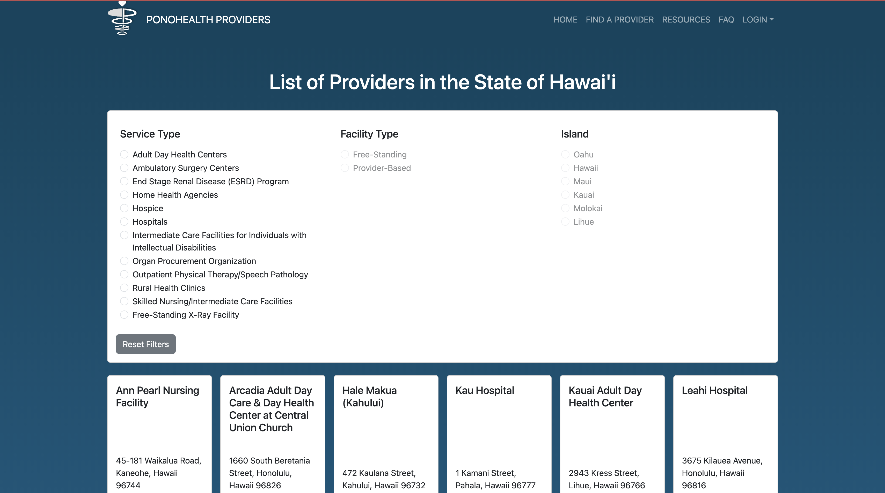
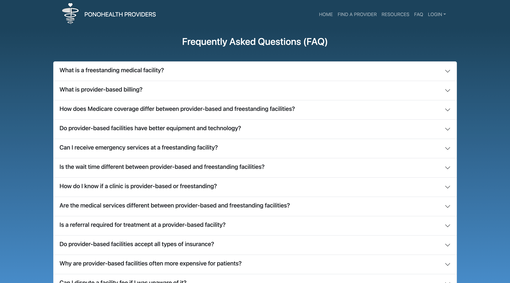
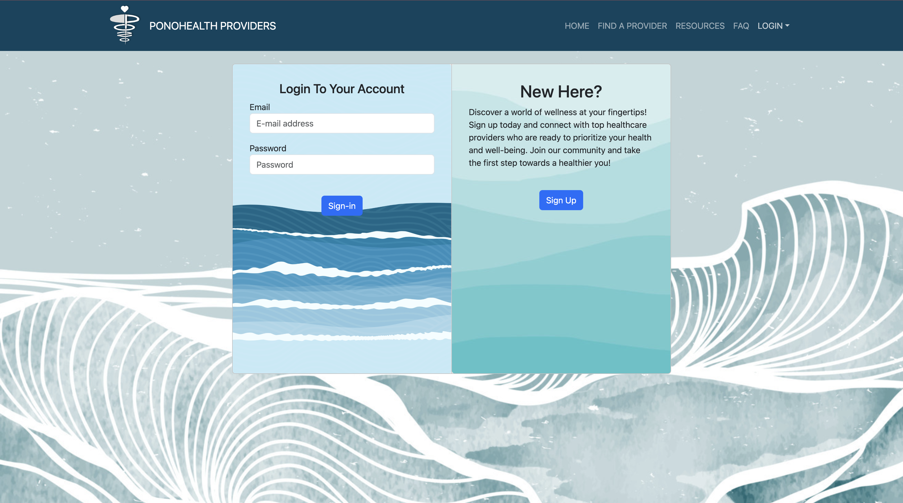

# **PonoHealth Providers**

## Project Task:
Our project was based on one of the challenges from The 2023 Hawai’i Annual Code Challenge (HACC) - "Affordable Healthcare Dashboard" by Tyler Hawaii. It addresses the crisis of affordable healthcare in Hawaii, where the cost of healthcare is increasing but support for underinsured/uninsured individuals is lacking. The challenge involves creating a solution that provides easily accessible and understandable information about affordable healthcare options. This solution is particularly aimed at helping uninsured or underinsured individuals find affordable and timely healthcare services. The project emphasizes the importance of accessibility and user-friendly interfaces, considering Hawaii's diverse population and varying healthcare needs.

## Project Description:
We formed a team, Team Jackfruit, and created the website PonoHealth Providers. Our website is a one-stop-shop for uninsured and under-insured patients to find affordable healthcare. It provides a comprehensive list of healthcare providers in Hawaii, including their contact information, services, and insurance plans accepted. It also includes a search function that allows users to filter providers based on their location, services, and insurance plans. Users are able to log in, find a provider of their choice, 'favorite' them to their profile and then find directions to the healthcare providers.  It also includes a list of resources and FAQ page for users who are unable to afford healthcare services or confused by how insurance works.

[View the website](https://ponohealthproviders.com/)

## My Contributions:
* Designed the mockup pages for our website.
* Created and shaped up the landing page, resources page, and profile page.
* Styled the login and signup pages, create user page, and edit user pages.
* Developed custom TestCafe scripts that implemented automatic testing procedures for all pages of our website.

## Key Learning Experiences:
+ Understand the basics of web page structure and design using HTML.
+ Learn CSS for styling web pages and how to create responsive designs with Bootstrap.
+ Learn how to use React to create interactive web pages.
+ Learn how to use Javascript to implement dynamic features on web pages.
+ Understand how to store, retrieve, and manipulate data in a database.
+ Learn how to use TestCafe to implement automatic testing procedures for web pages.

## Glimpse of Website
<Figure>
  
  <figcaption>Home Page</figcaption>
</Figure>

<Figure>
  
  <figcaption>Find a Provider Page</figcaption>
</Figure>

<Figure>
  
  <figcaption>Resources Page</figcaption>
</Figure>

<Figure>
  
  <figcaption>FAQ Page</figcaption>
</Figure>

<Figure>
  
  <figcaption>Sign In Page</figcaption>
</Figure>

<Figure>
  
  <figcaption>Sign Up Page</figcaption>
</Figure>

## Want to know more?
[View our Organization Github Page](https://team-jackfruit.github.io/PonoHealthProviders/)