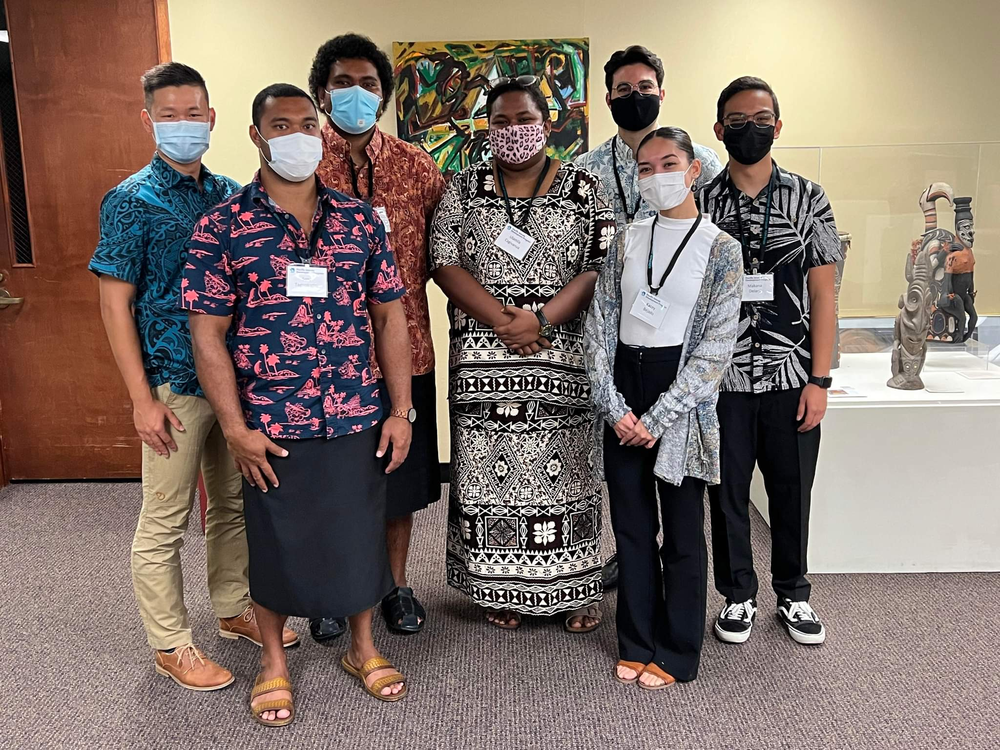

## Project Description:

The 11th Pacific Island Conference of Leaders served as a pivotal platform for Pacific Island Nations and Territories, supported by the Pacific Islands Development Program (PIDP), to convene virtually on June 1st and 2nd. The primary objective was to deliberate on critical regional priorities that profoundly impact the Pacific region, including climate change, economic development, infrastructure development, education advancement, and addressing equity and socio-economic disparities. The Pacific Islands Development Program is dedicated to enhancing the capabilities of member nations and territories through innovative capacity-building initiatives at both regional and community levels, fostering constructive dialogues among regional leaders and key partners, and conducting policy-relevant research on priority issues.

As part of PIDP's broader mission, there was a pressing need to reevaluate its role within regional organizations. One of the significant projects we undertook was the comprehensive review of PIDP's legislative framework, policies, and procedures, which dated back to its inception in the 1980s. This endeavor involved a meticulous examination of historical records and documents, tracking the evolution of legislation, policies, and procedures over time, and assessing their relevance to contemporary regional concerns. Our task was to scrutinize these documents, identify persisting issues of significant concern in the Pacific region, and analyze how any past recommendations had addressed or failed to address these issues.

Our efforts culminated in a presentation of our findings during the standing committee meeting held in December following the Pacific Island Conference of Leaders.

[Read more about the conference](https://pidp.eastwestcenter.org/2021/06/01/pacific-islands-conference-of-leaders-to-meet-virtually-june-1-2/)

## Role and Responsibilities:

In this project, I played a central role as a member of the team responsible for reviewing PIDP's legislative and policy framework. My responsibilities included conducting extensive research into historical records, legislation, policies, and procedures spanning several decades. I collaborated closely with colleagues to analyze the evolution of PIDP's role and identify the key regional issues that had persisted over the years. Additionally, I was involved in assessing the effectiveness of past recommendations and their impact on addressing these issues.

## Key Learning Experiences:

This project provided me with invaluable insights into the complexities of regional development and policy-making within the Pacific context. Specifically, I gained a deeper understanding of:

1. **Historical Context:** I learned to appreciate the significance of understanding an organization's historical context and how its evolution shapes its present-day role and responsibilities.

2. **Policy Analysis:** Through this project, I honed my skills in policy analysis, particularly in evaluating the effectiveness of policies and recommendations in addressing real-world challenges.

3. **Interdisciplinary Collaboration:** Collaborating with colleagues from diverse backgrounds and expertise areas reinforced the importance of interdisciplinary teamwork in tackling multifaceted regional issues.

4. **Regional Priorities:** I gained a comprehensive understanding of the critical regional priorities in the Pacific, particularly those related to sustainable development, equity, and environmental resilience.

Overall, this experience not only allowed me to contribute to the enhancement of PIDP's effectiveness but also provided me with a deeper appreciation of the complexities and nuances involved in policy development and regional collaboration. It underscored the importance of thorough research and evaluation in shaping policies that can truly address the evolving needs of the Pacific region.

