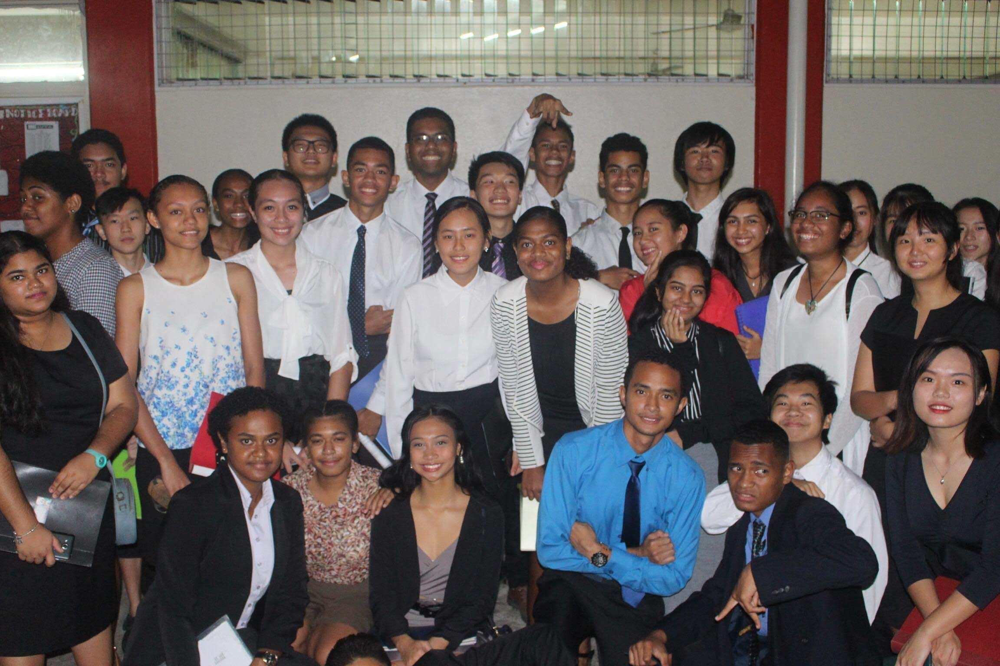

## Project Description

During my holiday trip back home to Fiji last winter, I initiated an educational outreach project aimed at assisting and guiding high school students in their pursuit of scholarships and higher education opportunities. The project encompassed a comprehensive overview of scholarship applications, essay writing techniques, and interview preparation. Additionally, I shared insights into various scholarships available to Fijian students, highlighting the differences in application processes and requirements.

## My Role and Responsibilities

In this project, I assumed the role of a mentor and educator, taking the lead in designing and delivering the presentation. My responsibilities included:

1. **Content Creation:** I meticulously researched and compiled information about the United States South Pacific Scholarship offered by the East West Center, drawing from my personal experience as a recipient. I also gathered data on several other prominent scholarship programs accessible to Fijian students, including the Australian DFAT Scholarship, India ICCR scholarship, Japan MEXT scholarship, Chinese Government Scholarship, and Korean GSK-U scholarship.

2. **Presentation Delivery:** I approached my high school teacher and secured her consent to deliver a talk to her year-level class. During the presentation, I comprehensively explained the application processes for these scholarships, providing step-by-step guidance and tips on crafting compelling scholarship essays and preparing for interviews.

3. **Ongoing Support:** Beyond the initial presentation, I maintained an active role in supporting prospective applicants. I continued to communicate with my high school teachers, sharing updates on scholarship opportunities, application deadlines, and any relevant information. Moreover, I engaged with junior students on a one-on-one basis, offering personalized advice and mentorship on their scholarship pursuits.

## What I Learned from the Experience

This project was a profoundly enriching experience that taught me several valuable lessons:

1. **Effective Communication:** I honed my skills in delivering complex information to a diverse audience, ensuring that it was accessible and comprehensible to high school students.

2. **Mentorship and Guidance:** I gained a deeper understanding of the importance of mentorship and how guidance from someone who has navigated the scholarship application process can significantly impact a student's chances of success.

3. **Community Engagement:** The project underscored the significance of giving back to the community and fostering educational opportunities for others. It reinforced my commitment to helping students achieve their academic and career goals.

4. **Personal Growth:** By mentoring and supporting others, I found a sense of fulfillment and personal growth. It reinforced my belief in the power of education to transform lives and communities.

In summary, this project was about providing essential information and guidance to high school students in Fiji, empowering them to pursue higher education opportunities through scholarships. My role as a mentor and educator allowed me to share my knowledge and experiences while learning valuable lessons about effective communication, mentorship, community engagement, and personal growth along the way.

